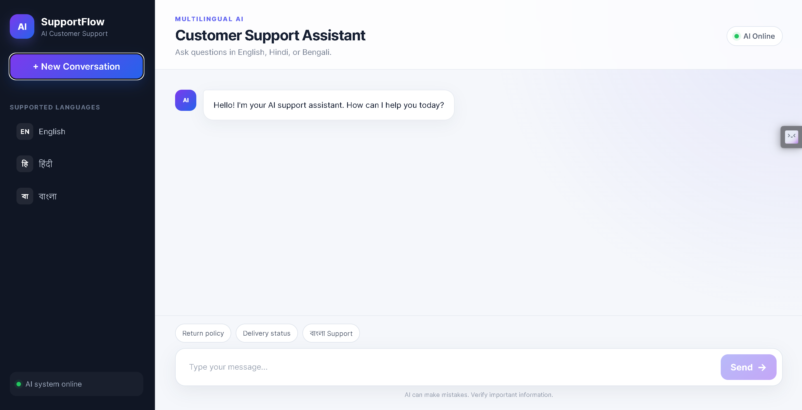
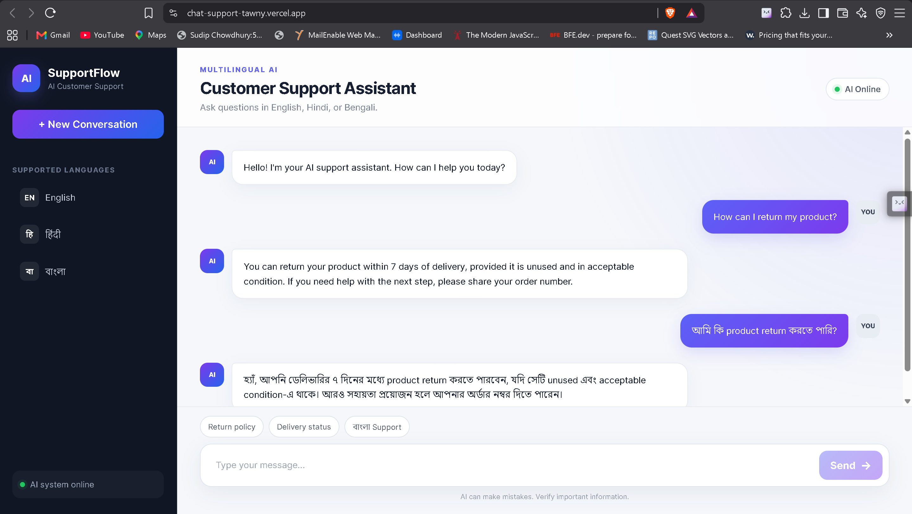

# SupportFlow — Multilingual AI Customer Support

<p align="center">
  <strong>AI-powered customer support for English, Hindi, and Bengali.</strong>
</p>

<p align="center">
  <a href="https://chat-support-tawny.vercel.app/"><strong>Live Frontend</strong></a>
  ·
  <a href="https://multilingual-chat-support.vercel.app"><strong>Backend API</strong></a>
</p>

<p align="center">
  
  
  
  
  
  
</p>

---

## Overview

**SupportFlow** is a full-stack multilingual AI customer-support application built to demonstrate practical LLM integration in a production-style web application.

Customers can ask support questions in **English, Hindi, or Bengali**, and the AI responds in the same language. The frontend is built with React and Vite, while an Express backend securely communicates with NVIDIA's hosted Nemotron model.

The project focuses on:

- Full-stack JavaScript development
- Third-party LLM API integration
- Multilingual / vernacular AI
- Prompt engineering
- Secure backend API-key handling
- CORS configuration
- Responsive SaaS-style UI
- Cloud deployment with Vercel

---

## Live Application

| Service | URL |
|---|---|
| Frontend | https://chat-support-tawny.vercel.app/ |
| Backend API | https://multilingual-chat-support.vercel.app |
| Chat endpoint | `POST https://multilingual-chat-support.vercel.app/api/chat` |

### Backend health check

Opening the backend root endpoint should return:

```json
{
  "message": "AI Support API is running"
}
```

---

## Screenshots

> Add current screenshots of the deployed application to the `assets/` directory and update the paths below.

<!--
Recommended filenames:

assets/supportflow-desktop.png
assets/supportflow-chat.png
assets/supportflow-mobile.png

Then uncomment:

<p align="center">
  
</p>

<p align="center">
  
</p>
-->

---

## Key Features

### Multilingual support

SupportFlow automatically handles customer conversations in:

- English
- Hindi
- Bengali

It can also handle mixed-language queries naturally.

Example:

```text
আমি কি product return করতে পারি?
```

### AI-powered customer support

The backend sends each customer query to an NVIDIA Nemotron model together with a controlled system prompt containing:

- Business information
- Support policies
- Language instructions
- Response constraints
- Safety rules against inventing unavailable business information

### Modern SaaS-style interface

The frontend includes:

- Responsive sidebar layout
- Clean user and AI message bubbles
- AI online indicator
- Suggested prompts
- Typing indicator
- Smooth automatic chat scrolling
- New conversation action
- Responsive layout for smaller screens

### Secure API architecture

The NVIDIA API key is stored only on the server.

The frontend never receives or exposes the secret API key.

### Production CORS configuration

The backend explicitly allows requests from the deployed frontend and local development environment.

---

## Architecture

```text
┌─────────────────────────────┐
│          Customer           │
└──────────────┬──────────────┘
               │
               ▼
┌─────────────────────────────┐
│      React + Vite UI        │
│  chat-support-tawny...      │
└──────────────┬──────────────┘
               │
               │ POST /api/chat
               ▼
┌─────────────────────────────┐
│     Node.js + Express       │
│ multilingual-chat-support  │
└──────────────┬──────────────┘
               │
               │ HTTPS
               ▼
┌─────────────────────────────┐
│       NVIDIA API / NIM      │
└──────────────┬──────────────┘
               │
               ▼
┌─────────────────────────────┐
│      Nemotron LLM           │
└──────────────┬──────────────┘
               │
               ▼
┌─────────────────────────────┐
│  Customer-facing response   │
└─────────────────────────────┘
```

---

## Tech Stack

### Frontend

- React
- Vite
- JavaScript
- CSS
- Fetch API

### Backend

- Node.js
- Express.js
- `cors`
- `dotenv`

### AI

- NVIDIA hosted inference API
- Nemotron LLM
- System-prompt-based customer-support behavior

### Deployment

- Vercel — frontend
- Vercel — backend

---

## Project Structure

```text
multilingual-ai-support/
│
├── client/
│   ├── src/
│   │   ├── App.jsx
│   │   ├── App.css
│   │   └── main.jsx
│   ├── .env
│   ├── package.json
│   └── vite.config.js
│
├── server/
│   ├── server.js
│   ├── .env
│   └── package.json
│
├── .gitignore
├── assets/
└── README.md
```

---

## How It Works

When the user sends a message:

1. React reads the message from the chat input.
2. The frontend sends a `POST` request to `/api/chat`.
3. Express validates the request.
4. The backend combines the user message with the customer-support system prompt.
5. The backend calls NVIDIA's chat-completions endpoint.
6. Nemotron generates a response.
7. The backend returns only the customer-facing reply.
8. React adds the AI response to the chat interface.
9. The conversation automatically scrolls to the latest message.

---

## API

### `POST /api/chat`

Send a customer-support message to the AI.

#### Request

```json
{
  "message": "How can I return my product?"
}
```

#### Example response

```json
{
  "reply": "You can return the product within 7 days of delivery, provided it is unused and in acceptable condition."
}
```

### Example with Hindi

#### Request

```json
{
  "message": "मेरा ऑर्डर कितने दिन में आएगा?"
}
```

#### Response

```json
{
  "reply": "आपका ऑर्डर सामान्यतः 3-5 कार्यदिवसों में डिलीवर हो जाता है।"
}
```

### Example with Bengali

#### Request

```json
{
  "message": "আমি কি product return করতে পারি?"
}
```

#### Response

```json
{
  "reply": "হ্যাঁ। ডেলিভারির ৭ দিনের মধ্যে product return করা যাবে, যদি সেটি unused এবং acceptable condition-এ থাকে।"
}
```

---

## Demo Business Knowledge

The current prototype uses a demo business called **DemoMart**.

### Return policy

- Products can be returned within 7 days of delivery.
- Returned products should be unused and in acceptable condition.

### Shipping

- Orders normally arrive within 3–5 business days.

### Refunds

- Approved refunds are processed within 5–7 business days.

### Support hours

- Monday to Saturday
- 9:00 AM to 6:00 PM

This information is currently included in the backend system prompt.

---

## Environment Variables

### Frontend

Create:

```text
client/.env
```

For local development:

```env
VITE_API_URL=http://localhost:5000
```

For production, configure the frontend deployment with:

```env
VITE_API_URL=https://multilingual-chat-support.vercel.app
```

> Vite variables prefixed with `VITE_` are exposed to the browser. Never store secret API keys in the frontend environment.

### Backend

Create:

```text
server/.env
```

Add:

```env
NVIDIA_API_KEY=your_nvidia_api_key
PORT=5000
```

Never commit this file.

---

## `.gitignore`

A root-level `.gitignore` can be used for both frontend and backend:

```gitignore
node_modules/
.env
.env.*
dist/
*.log
.DS_Store
Thumbs.db
```

If a secret was already committed or pushed, remove it from Git tracking and rotate the exposed API key.

---

## Run Locally

### 1. Clone the repository

```bash
git clone https://github.com/YOUR_USERNAME/YOUR_REPOSITORY.git
cd multilingual-ai-support
```

### 2. Install and start the backend

```bash
cd server
npm install
npm run dev
```

The API should be available at:

```text
http://localhost:5000
```

### 3. Install and start the frontend

Open another terminal:

```bash
cd client
npm install
npm run dev
```

The Vite development server is normally available at:

```text
http://localhost:5173
```

---

## CORS Configuration

Because the frontend and backend are deployed on different origins, the backend must allow both local development and the production frontend.

Example:

```js
const allowedOrigins = [
  "http://localhost:5173",
  "https://chat-support-tawny.vercel.app",
];

app.use(
  cors({
    origin(origin, callback) {
      if (!origin) {
        return callback(null, true);
      }

      if (allowedOrigins.includes(origin)) {
        return callback(null, true);
      }

      return callback(new Error("Origin not allowed by CORS"));
    },
    methods: ["GET", "POST", "OPTIONS"],
    allowedHeaders: ["Content-Type", "Authorization"],
  })
);
```

---

## Security Notes

- The NVIDIA API key stays on the Express backend.
- The API key is never sent to the frontend.
- `.env` files are excluded from Git.
- Production requests are restricted using CORS.
- The AI is instructed not to invent order status, payment status, shipment status, refunds, cancellations, or business policies that are not provided.
- Server logs should never print secret API keys.

---

## Current Limitations

This is an MVP / portfolio project.

It currently does **not** provide:

- Real customer authentication
- Live order tracking
- Real payment information
- Actual refund processing
- Human support-agent handoff
- Persistent conversations
- A database-driven knowledge base

The AI should therefore never claim that it performed any of those actions.

---

## Roadmap

Planned improvements:

- [ ] MongoDB conversation history
- [ ] User authentication
- [ ] Admin dashboard
- [ ] Dynamic business knowledge base
- [ ] Multi-tenant SaaS architecture
- [ ] Speech-to-Text
- [ ] Text-to-Speech
- [ ] Multilingual voice assistant
- [ ] WhatsApp Business API integration
- [ ] Human-agent escalation
- [ ] RAG-based knowledge retrieval
- [ ] PDF / document knowledge upload
- [ ] Customer conversation dashboard
- [ ] Analytics
- [ ] Dark mode
- [ ] Streaming AI responses

---

## Future SaaS Architecture

```text
                         ┌───────────────────┐
                         │     Customers     │
                         └─────────┬─────────┘
                                   │
                    ┌──────────────┼──────────────┐
                    │              │              │
                    ▼              ▼              ▼
                  Web          WhatsApp         Voice
                    │              │              │
                    └──────────────┼──────────────┘
                                   │
                                   ▼
                         ┌───────────────────┐
                         │    Express API    │
                         └─────────┬─────────┘
                                   │
                  ┌────────────────┼────────────────┐
                  │                │                │
                  ▼                ▼                ▼
              MongoDB         Knowledge Base      LLM
                  │                │                │
                  └────────────────┼────────────────┘
                                   │
                                   ▼
                         Customer Response
```

---

## What This Project Demonstrates

This project demonstrates hands-on experience with:

- React frontend development
- Node.js and Express
- REST API development
- Third-party API integration
- LLM integration
- Prompt engineering
- Multilingual / vernacular AI
- CORS
- Environment-variable management
- Secure handling of API secrets
- Production deployment
- Responsive SaaS interface design

---

## Author

**Sudip Chowdhury**

Full-stack JavaScript developer exploring practical AI/LLM integrations, multilingual AI, and production-oriented SaaS development.

---

## Support

If you found this project useful, consider giving the repository a star.

Contributions, suggestions, and feedback are welcome.
